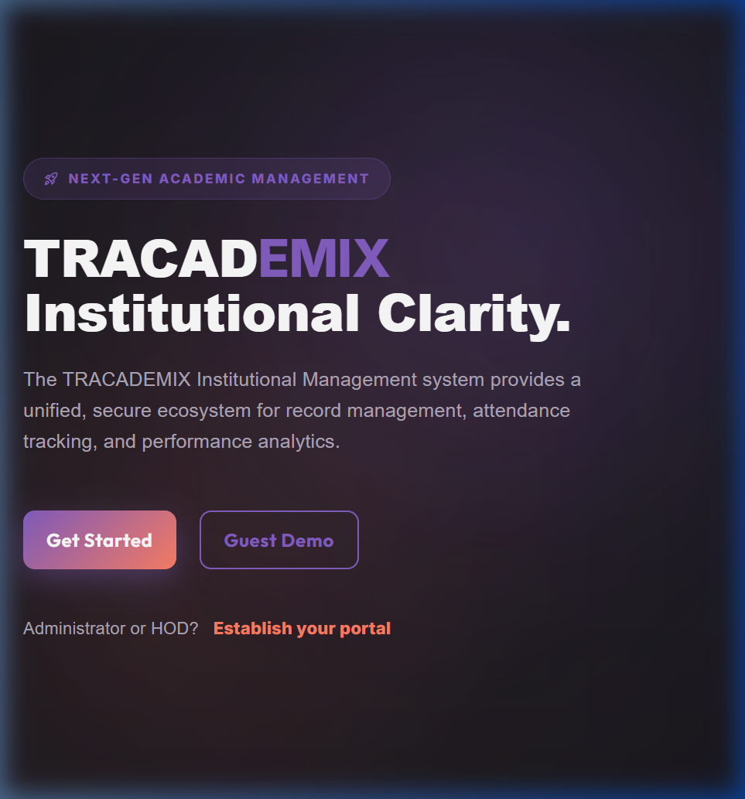
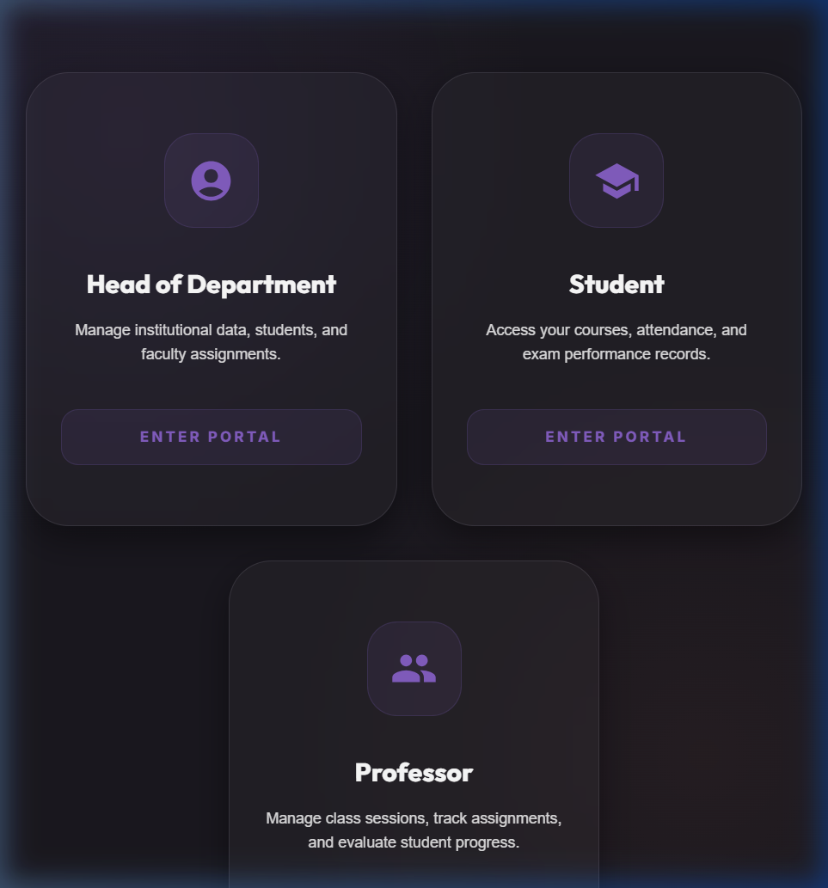
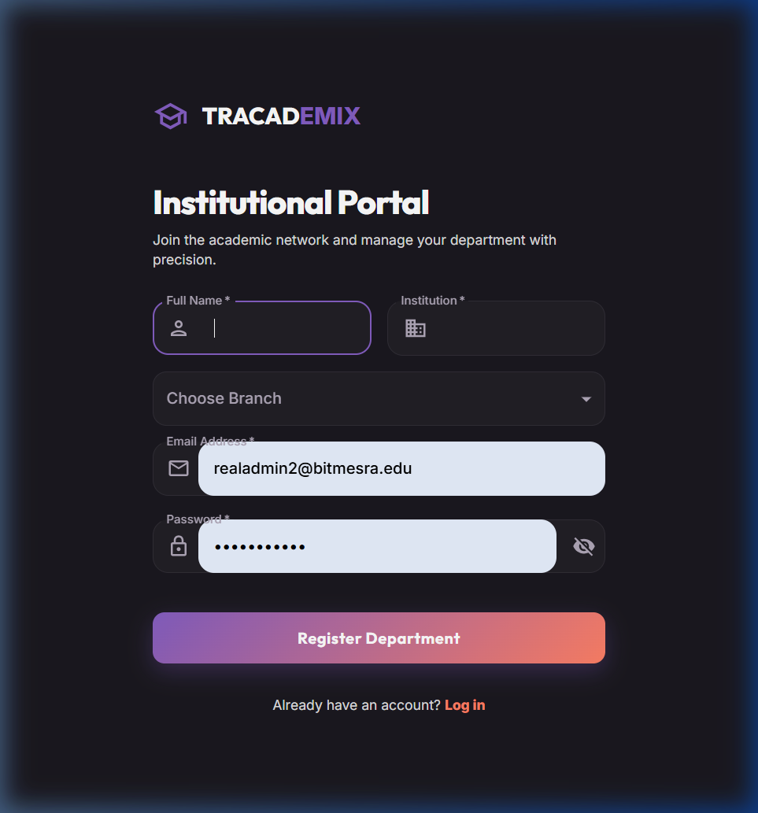
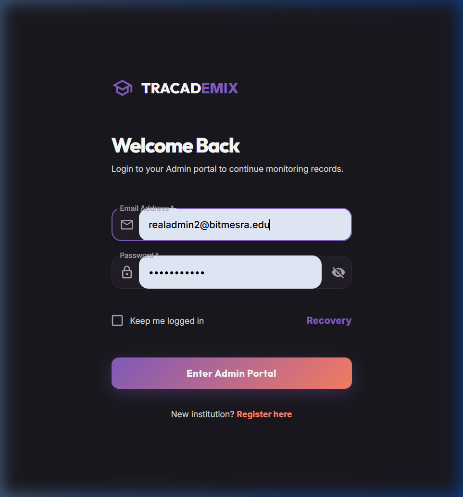
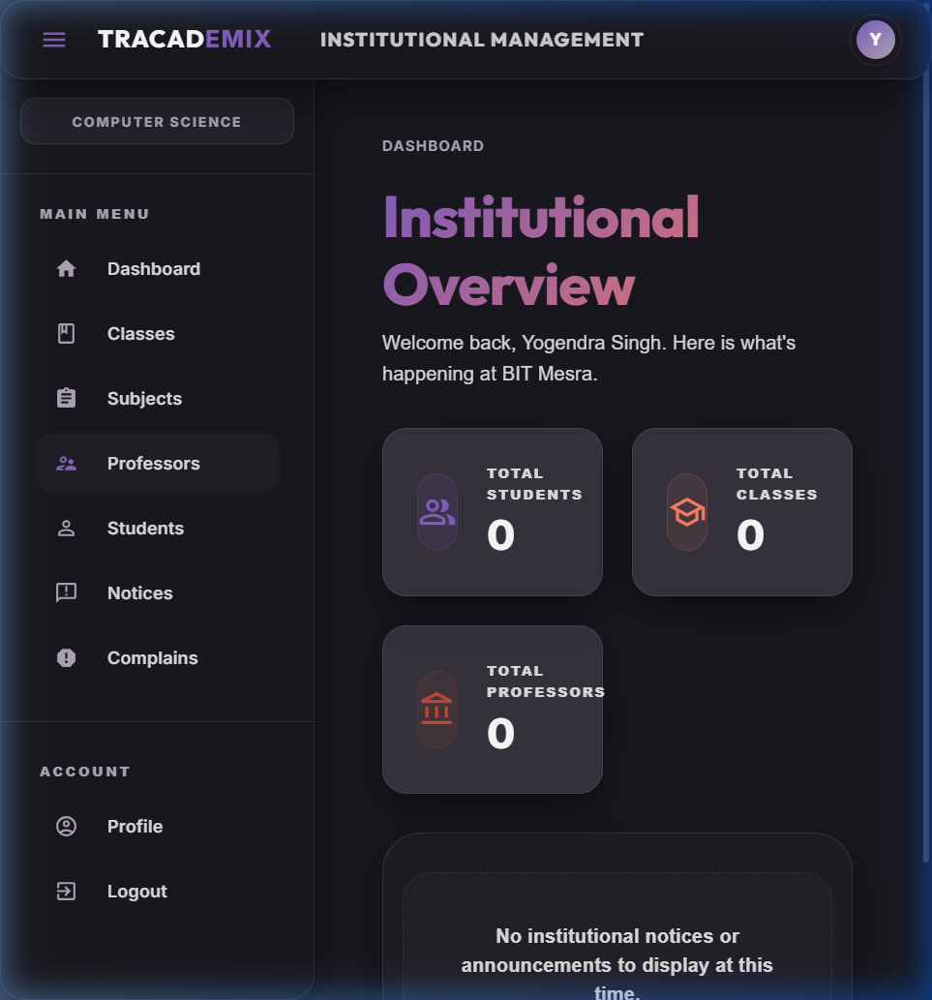

# TRACKADEMIX | Institutional Management System

Streamlining BIT management, class organization, and performance tracking for Students and Professors. Seamlessly track attendance, assess performance, and provide feedback in a modern, Supabase-powered environment.

## 🚀 About
TRACKADEMIX is a comprehensive institutional management system built with the **SERN** stack (Supabase, Express.js, React.js, Node.js). It replaces the legacy MongoDB backend with a robust, relational PostgreSQL architecture provided by Supabase, ensuring high performance, security, and scalability.

## ✨ Features
- **User Roles:** Distinct dashboards for HOD (Admin), Professors, and Students.
- **Admin Dashboard:** HODs can manage students, professors, classes, and subjects.
- **Attendance Tracking:** Real-time attendance management for professors.
- **Performance Assessment:** Integrated marks and feedback system.
- **Data Visualization:** Interactive charts for student performance tracking.
- **Modern Security:** Row Level Security (RLS) and secure authentication.

## 🛠️ Technologies Used
- **Frontend:** React.js, Material UI
- **Backend:** Node.js, Express.js
- **Database:** Supabase (PostgreSQL)
- **State Management:** Redux Toolkit

## 📦 Installation & Setup

### 1. Backend Setup
```bash
cd backend
npm install
npm start
```
Create `backend/.env` (or copy from `backend/.env.example`) and set:

- `SUPABASE_URL`
- `SUPABASE_ANON_KEY`
- `JWT_SECRET` (required)
- `ORIGIN` (usually `http://localhost:3000`)

By default the backend runs on `PORT=5501` (recommended for local dev).

### 2. Frontend Setup
```bash
cd frontend
npm install
npm start
```
Create `frontend/.env` (or copy from `frontend/.env.example`) and set:

- `VITE_API_BASE_URL=http://localhost:5501`

Optional:

- `VITE_ENABLE_GUEST_DEMO=true` to enable the guest demo password (`zxc`).

---

## 📸 Screenshots

### Home Page


### Choose User Role


### HOD Registration


### HOD Login


### HOD Dashboard


---
© 2024 TRACKADEMIX - Empowering Education through Technology.
