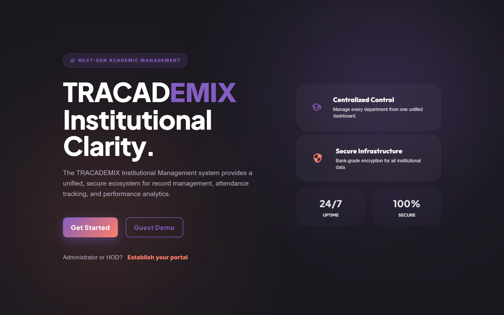
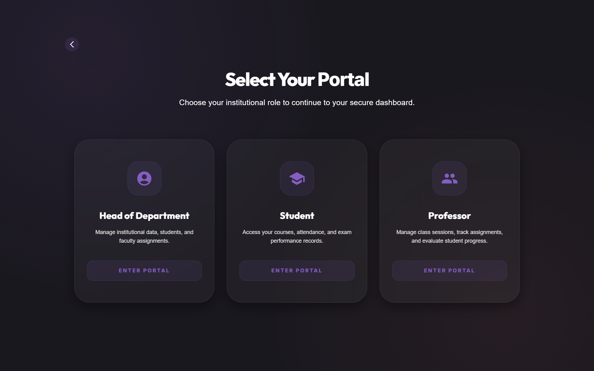
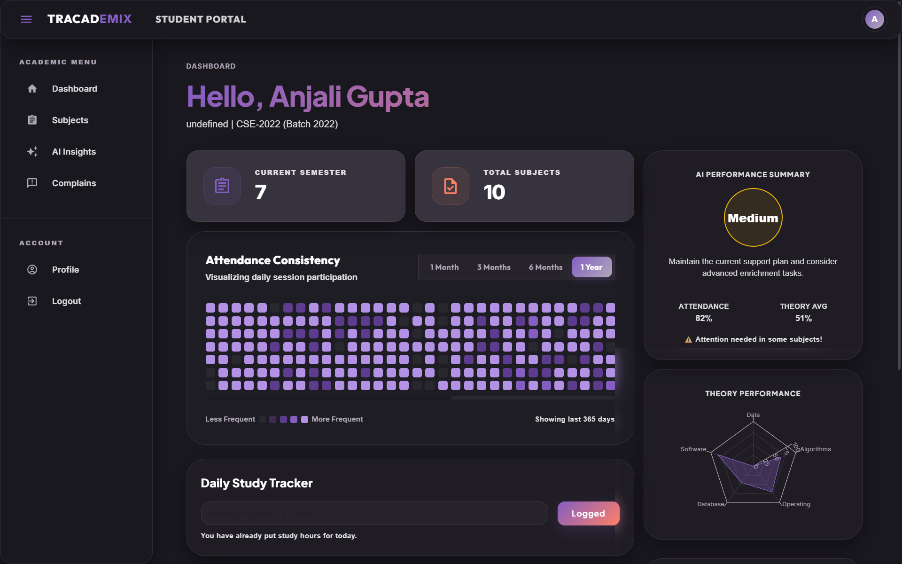
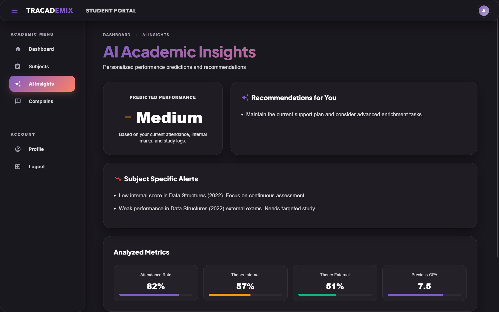
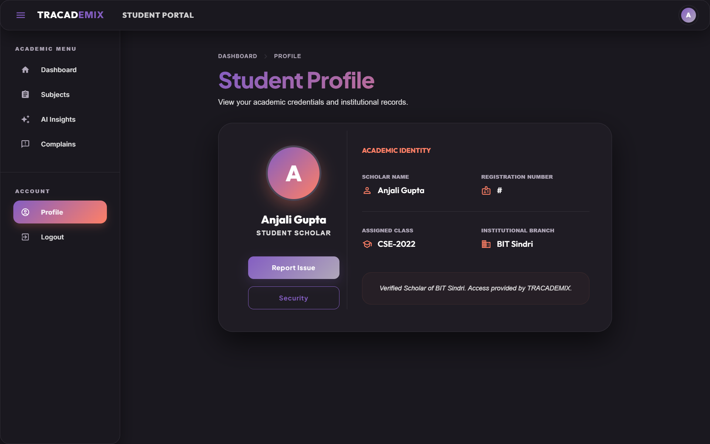
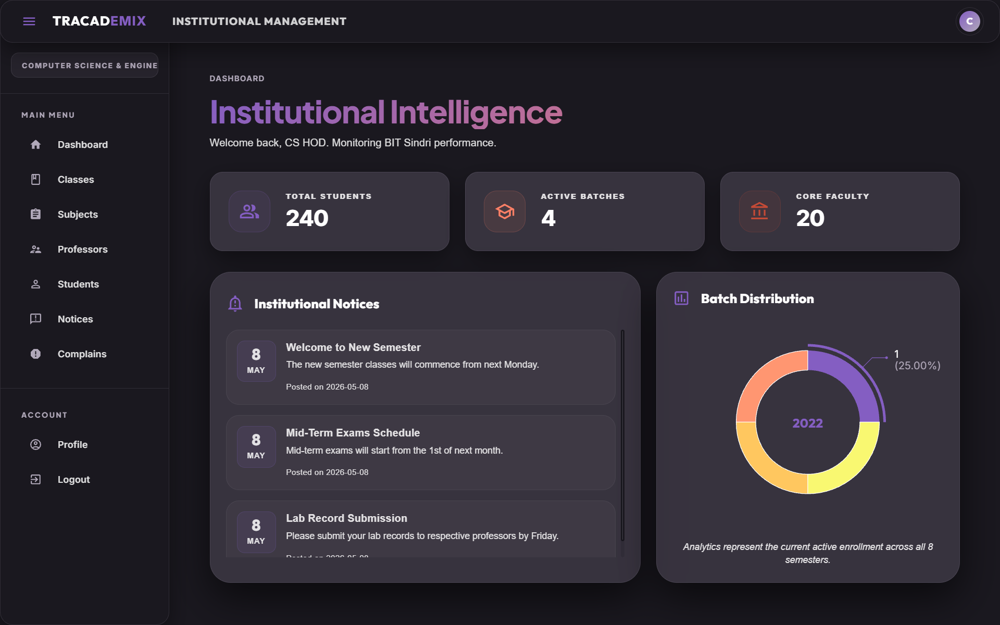
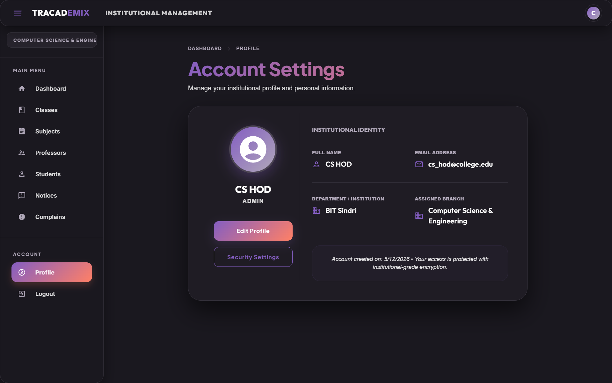
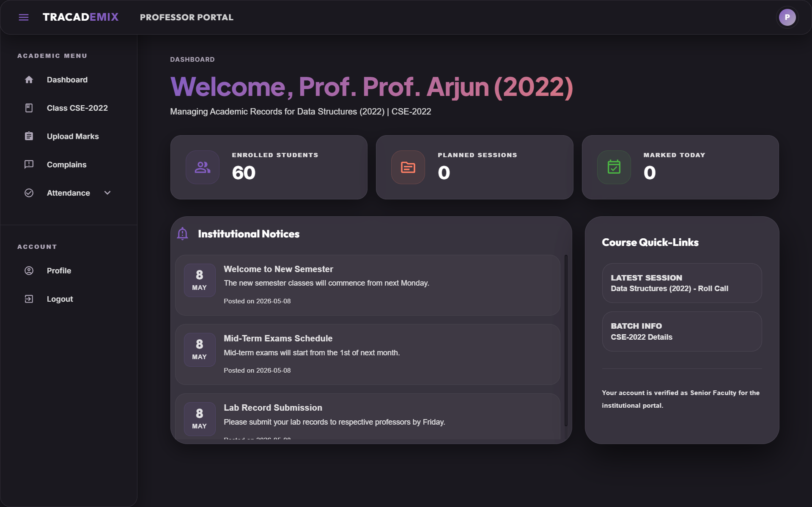
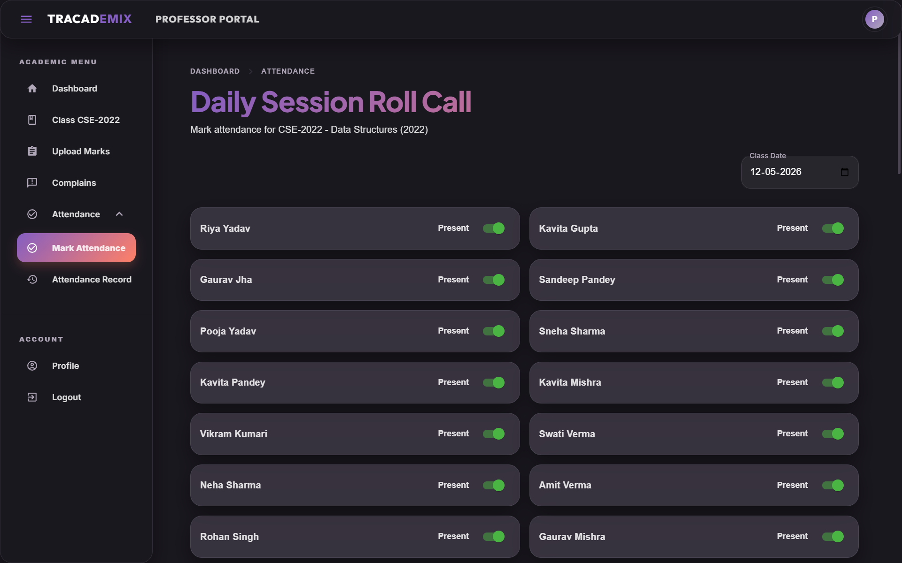
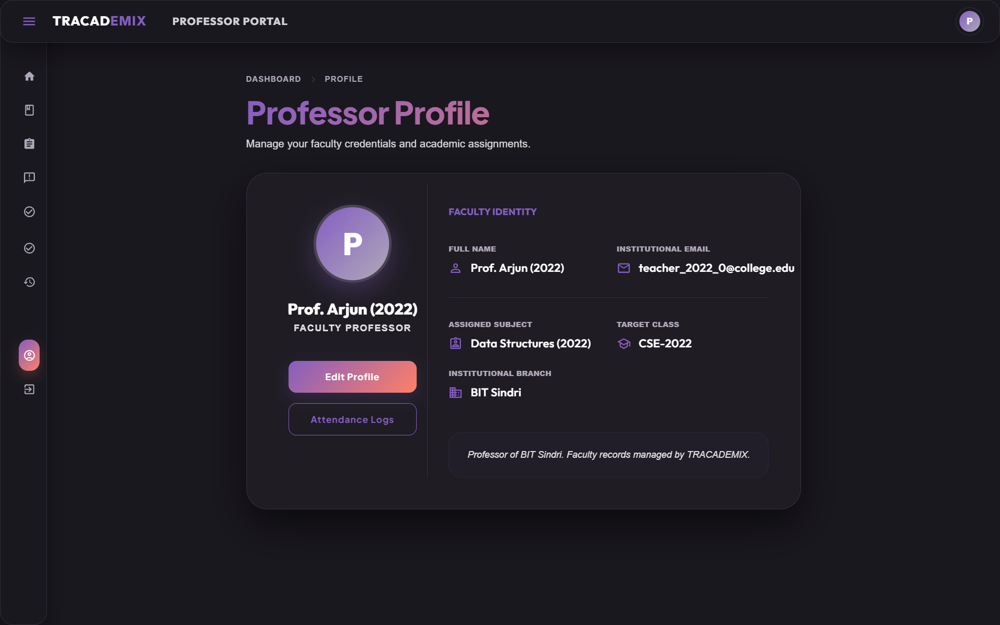

# TRACADEMIX - Centralized Academic Records & Performance Tracking System

TRACADEMIX is a modern, feature-rich academic management platform designed to track student performance, attendance, and provide AI-driven insights and recommendations. It is built to handle complex academic structures (like Theory and Practical splits) and use Machine Learning to predict student success.

---

## 🚀 Key Features

### 👨‍🎓 Student Portal
- **Dashboard**: A premium, glassmorphic dashboard with quick stats.
- **Attendance Heatmap**: Visualizes daily session participation over a year.
- **Subject Performance**: Split Radar charts for Theory and Practical subjects.
- **Daily Study Tracker**: Log study hours directly from the dashboard.
- **AI Insights**: Personalized performance predictions (High/Medium/Low) and recommendations based on study habits, attendance, and marks.

### 🔐 Admin Portal
- **Management**: Manage students, teachers, classes, and subjects.
- **Academic Setup**: Configure batches, semesters, and subject types (Theory vs Practical).

### 🤖 AI Performance Predictor
- **High Accuracy**: Powered by a Random Forest Classifier achieving **~93% accuracy**.
- **Transparent Metrics**: Shows students exactly what metrics (Attendance, Theory scores, etc.) are being analyzed.

---

## 🛠️ Tech Stack

- **Frontend**: React.js, Material-UI (MUI), Styled Components, Recharts (for analytics).
- **Backend**: Node.js, Express.js.
- **Database**: Supabase (PostgreSQL) with Row-Level Security.
- **AI/ML**: Python 3.12, Scikit-Learn, Pandas, NumPy.

---

## 📂 Project Structure

```text
Trackademics/
├── frontend/             # React application
├── backend/              # Node.js Express server
│   └── database/         # Contains complete_schema.sql
└── ai-trackademics/      # Python AI model & scripts
```

---

## ⚙️ Installation & Setup

### Prerequisites
- Node.js (v18+)
- Python 3.12+
- Supabase Account

### 1. Database Setup
1. Go to your Supabase project.
2. Open the **SQL Editor**.
3. Copy the contents of `backend/database/complete_schema.sql` and run it to initialize all tables and relationships.

### 2. Backend Setup
1. Navigate to the `backend` directory:
   ```bash
   cd backend
   ```
2. Install dependencies:
   ```bash
   npm install
   ```
3. Create a `.env` file and add your Supabase URL and Anon Key:
   ```env
   SUPABASE_URL=your_supabase_url
   SUPABASE_ANON_KEY=your_supabase_anon_key
   PORT=3001
   ```
4. Start the server:
   ```bash
   npm start
   ```

### 3. Frontend Setup
1. Navigate to the `frontend` directory:
   ```bash
   cd frontend
   ```
2. Install dependencies:
   ```bash
   npm install
   ```
3. Create a `.env` file and set the backend API URL:
   ```env
   REACT_APP_API_URL=http://localhost:3001
   ```
4. Start the development server:
   ```bash
   npm start
   ```

### 4. AI Setup (Optional for execution)
The backend automatically spawns the Python process to run predictions. However, to retrain the model:
1. Navigate to `ai-trackademics`.
2. Create a virtual environment and install requirements:
   ```bash
   python -m venv .venv
   .venv\Scripts\activate
   pip install -r requirements.txt
   ```
3. Run the training script:
   ```bash
   python -m src.student_performance_ai.training
   ```

---

## 📸 Screenshots

Here are the screenshots of the new, modern UI of TRACADEMIX:

### 🏠 Homepage & Portal Selection



### 👨‍🎓 Student Portal




### 🔐 Admin Portal



### 👨‍🏫 Professor Portal





